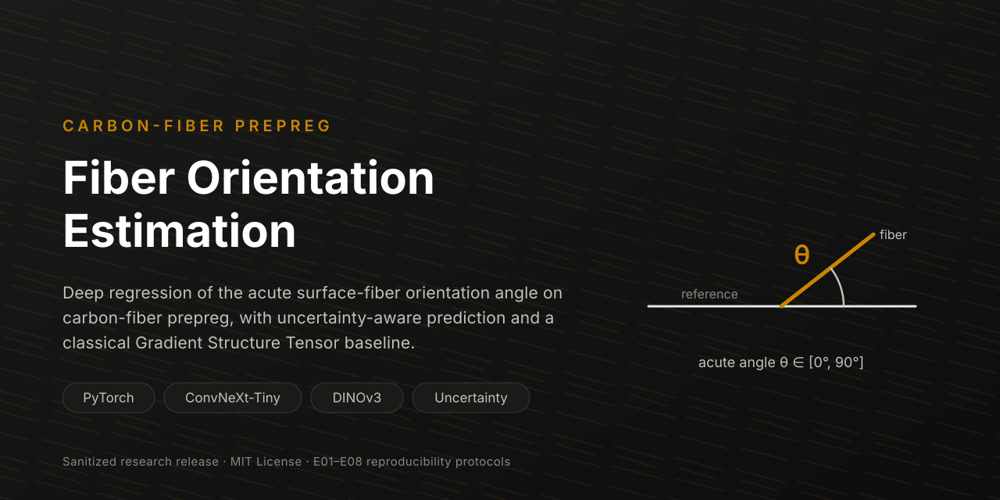
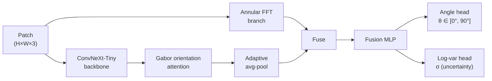

<p align="center">
  
</p>

# Prepreg Fiber Orientation Estimation

[](https://github.com/Taxueovo/prepreg-fiber-orientation/actions/workflows/ci.yml)
[](LICENSE)

[](https://pytorch.org)

Research code for estimating the **acute surface-fiber orientation angle** of carbon-fiber prepreg from microscopy patches. The model uses a **ConvNeXt-Tiny** spatial backbone, optionally initialized from **DINOv3** self-supervised weights, and combines orientation-aware attention, an annular FFT frequency branch, and heteroscedastic uncertainty estimation.

> **Sanitized code release.** Raw images, label manifests, model weights, experiment outputs, manuscripts, author information, and machine-specific paths are intentionally excluded. The repository does not claim benchmark results that cannot be independently verified from the published artifacts.

## Table of Contents

- [Highlights](#highlights)
- [Method Overview](#method-overview)
- [Repository Layout](#repository-layout)
- [Quick Start](#quick-start)
- [Installation](#installation)
- [Dataset Layout](#dataset-layout)
- [Training](#training)
- [GST Baseline](#gst-baseline)
- [Reproducibility Experiments](#reproducibility-experiments)
- [Validation](#validation)
- [License](#license)

## Highlights

- Parent-image-disjoint train, validation, and test interfaces.
- ConvNeXt-Tiny backbone with optional orientation-aware spatial attention.
- Optional annular FFT feature branch.
- Acute-angle regression with optional heteroscedastic loss.
- Validation-based early stopping, per-epoch metrics, checkpointing, and path-safe prediction exports.
- A Gradient Structure Tensor (GST) classical computer-vision baseline.
- Eight reproducibility protocols (E01–E08): initialization controls, factorial ablation, external-domain evaluation, uncertainty calibration, metrology validation, label efficiency, rotation equivariance, and latency analysis.

## Method Overview

A ConvNeXt-Tiny backbone extracts spatial features from microscopy patches. An optional **Gabor orientation attention** module (inserted after backbone stage 2) learns an orientation-relevant attention map, while an optional **annular FFT branch** pools frequency content in a ring band around the spectrum center. The two streams are fused and fed to an angle regression head; an optional heteroscedastic head predicts per-sample log-variance to quantify uncertainty.



The target angle is folded into the acute range `[0°, 90°]` before regression; the predicted angle is recovered as `θ = 90° · sigmoid(head)`.

## Repository Layout

```text
.
├── fiber_orientation.py         # Training / regression entry point
├── gst_baseline.py              # Gradient Structure Tensor baseline
├── thesis_experiment_packages/  # E01–E08 reproducibility protocols
├── tests/                       # Release checks (no deep-learning deps)
├── docs/banner.svg              # Repository banner
├── .github/workflows/ci.yml     # CI pipeline
├── requirements.txt
└── LICENSE
```

## Quick Start

```bash
git clone https://github.com/Taxueovo/prepreg-fiber-orientation.git
cd prepreg-fiber-orientation

python -m venv .venv
source .venv/bin/activate
python -m pip install --upgrade pip
python -m pip install -r requirements.txt

python fiber_orientation.py --data-dir /path/to/database --device cuda:0
```

## Installation

Python 3.10 or 3.11 is recommended. Install the PyTorch build appropriate for your CUDA, ROCm, or CPU environment, then install the remaining dependencies:

```bash
python -m venv .venv
source .venv/bin/activate
python -m pip install --upgrade pip
python -m pip install -r requirements.txt
```

## Dataset Layout

The dataset is user-supplied and must not be committed to Git. The default layout is:

```text
database/
├── train/
│   ├── train.csv
│   └── images/
├── val/
│   ├── val.csv
│   └── images/
└── test/
    ├── test.csv
    └── images/
```

Each CSV must contain at least:

```csv
patch_filename,source_image,angle,x,y
sample_0001.jpg,source_001.jpg,45.0,0,0
```

`patch_filename` must be a safe path relative to the corresponding `images/` directory. `angle` is folded into the acute range `[0°, 90°]`. The `source_image`, `x`, and `y` fields support parent-image traceability; the training loader directly consumes `patch_filename` and `angle`.

## Training

```bash
python fiber_orientation.py \
  --data-dir /path/to/database \
  --weights /path/to/dinov3_convnext_tiny.pth \
  --require-pretrained \
  --device cuda:0 \
  --epochs 150 \
  --batch-size 64
```

If `--weights` is omitted, the backbone uses random initialization. For controlled pretraining experiments, also pass `--require-pretrained` so a missing checkpoint fails explicitly. `--device auto` selects CUDA when available and otherwise uses CPU; `cpu`, `cuda:0`, and `mps` can also be selected explicitly.

Common paths may be configured with environment variables:

```bash
export FIBER_ORIENTATION_DATA_DIR=/path/to/database
export FIBER_ORIENTATION_WEIGHTS=/path/to/checkpoint.pth
export FIBER_ORIENTATION_RUNS_DIR=/path/to/runs
export FIBER_ORIENTATION_DEVICE=cuda:0
```

Training artifacts are written to `runs/` by default and are ignored by Git. Configuration snapshots and prediction exports remove workstation-specific absolute paths.

## GST Baseline

```bash
python gst_baseline.py \
  --csv /path/to/test.csv \
  --image_root /path/to/test/images \
  --output /path/to/gst_predictions.csv
```

## Reproducibility Experiments

See [thesis_experiment_packages/README.md](thesis_experiment_packages/README.md) for the eight experiment protocols. Training scripts read from `FIBER_ORIENTATION_DATA_DIR` or the project-local `database/` directory. Generated outputs are written under the ignored `thesis_experiment_packages/results/` directory.

## Validation

The release checks do not require deep-learning dependencies:

```bash
PYTHONPYCACHEPREFIX=/tmp/fiber-orientation-pycache python -m compileall -q \
  fiber_orientation.py gst_baseline.py thesis_experiment_packages tests
python -m unittest discover -s tests -v
```

Full training requires legally obtained data and a compatible checkpoint. Follow the licenses and usage terms of the dataset, pretrained model, and third-party dependencies.

## License

Distributed under the [MIT License](LICENSE). Data, labels, and pretrained checkpoints are not covered by this license.
